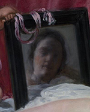

# Práctica-01 GitHub

## Indice
- - -
Introducción [^1]

Git init [^2]

Creación de index [^3]

Creación de estilos [^4]

Decisiones en los commits [^5]

Conclusiones [^6]

- - -


[^1]: ### Introducción


    Para la creacion de esta pagina web he utilizado HTML y CSS, en el que dentro del body tendremos un header y un div, y dentro de este ultimo hay tres sections en los que separaremos las tres partes principales de la misma:
    Los cuadros en miniatura en la parte izquierda de la pagina 
    ```HTML 
    <section class="izq">
                        <a href="index.html"></a>
                        <a href="venus.html"></a>
                        <a href="meninas.html"></a>
                        <a href="vulvcano.html"></a>
                        <a href="inocencio.html"></a>
                    </section>
    ```               
    El cuadro elegido que se mostrara en el centro de la pagina
    ```HTML         
    <section class="cen">
        
    </section>
    ```
    El texto y boton que hacen referencia a la imagen elegida en la derecha de la pagina
    ```HTML 
            <section class="der">
                <h1 class="textdrc" id="titulo">LA RENDICIÓN DE BREDA</h1>
                <p class="textdrc" id="años">1634-35</p>
                <p class="textdrc" id="prec"><strong>380€</strong></p>
                <p class="textdrc" id="desc">Replica del cuadro en colores originales y tamaño 150x80cm</p>
                <button class="textdrc" id="btm"><strong>COMPRAR</strong></button>
            </section>
    ```
[^2]: ### Git init


    Para crear el repositorio de git hemos utilizado la aplicacion git, en la carpeta del proyecto es donde hemos iniciado con el mismo usando el comando **git init** que a preparado el directorio para poder trabajar con el.
    Segun he continuado con el proyecto he ido añadiendo los nuevos avances al control de versiones, confirmando los archivos con **git add .** para que me añadiese todos los archivos que han sido modificados desde el ultimo guardado, y una vez confirmados usaremos **commit -m "*comentario*"** para guardarlos definitivamente. 
    
    
    

[^3]: ### Creación de index

    Para la creación del HTML pense ir dividiendo la pagina en varios apartados, en el apartado principal que es el body lo he dividido en dos, el **header** y un **div**.
    Dentro de este ultimo hay tres sections los cuales son los que le dan forma a la pagina ya que son:
    -   Izquierda: La parte izquierda es la que contiene el menu de los cuadros pequeños que permite navegar entre ellos. para ello le di los 200 pixeles que se pide en el ejercicio y le puse la propiedad **overflow** directamente a la sección. Como las imagenes ya estaban escaladas para el ejercicio no a hecho falta hacer nada con ellas
    
    -   Centro: La parte central es el cuadro seleccionado en grande, para ello de lo que sobra del menu izquierdo he cogido la mitad para este apartado y la otra mitad para el apartado izquierdo. Al no haber realizado el codigo JavaScript este apartado no tiene mucho.
    
    -   Derecha: En este apartado he tenido que centrar el texto y boton en el espacio que sobra y darle formato a las letras y al boton, para ello la gran mayoria es del apartado de **CSS** en el que he tenido que quitar formato a el boton y redondearle los bordes con **boreder-radius**. Para el texto se ha ajustado a lo pedido en el ejercicio con la letra Montserrat.

[^4]: ### Creación de estilos

    Para la creación de estilos a sido el apartado que más me ha costado, ya que no he hecho el apartado de Java Script, para ello he tenido que separar el HTML en cuatro, y tambien los elementos como las imagenes, textos, formato de la letra, menu inquierdo con scroll...


[^5]: ### Decisiones en los commits

    Para la decisión de los commits he seguido esta logica:
    -   Primer commit: Para este commit llamado ***puesta a punto*** he realizado la estructura basica de carpetas, index, estilos y los primeros comandos de git como init, add...
    
    -   Segundo commit: Para este commit llamado ***Primer boceto*** realice la separación del body en header y el div y este ultimo en tres, aunque todabia no estaban bien ajustadas los componentes de la pagina, pero ya estaba creada la estructura basica.
    
    -   Tercer commit: Para este commit llamado ***Empezando el formato de la pagina*** arregle varios problemas de posicionamiento y del espacio que ocupaban los apartados, casi todo lo modificado en este apartado a sido es estilos CSS, aunque todavia hay algun problema como por ejemplo el header.
    
    -   Cuarto commit: Para este commit llamado ***Concretando formato (parte izquierda y derecha)*** termine de ajustar la parte izquieda y darle la propiedad overflow bien ajustada y tambien termine con los textos y casi de ajustar el boton de la parte derecha, pero la pagina ya iba cogiendo forma.
    En este commit sigo teniendo el problema con el header
    
    -   Quinto commit: Para este commit llamado ***Retoques finales y ajustado*** he arreglado varios fallos, entre ellos el del header y he terminado de dar formato a la parte derecha de la pagina (el tercer section), tambien he revisado alguna linea de los index y el css, viendo que no tenia bien cerrado el div que hace de contenedor de los section y arreglandolo.
    
    -   Sexto commit: Para este commit ***Finalización y README*** he terminado de dar los ultimos retoques y la gran mayoria a sido la creación del README, que es esta documentación.

[^6]: ### Conclusiones

     Este trabajo a sido interesante, ya que se refrescan muchos de los conocimientos adquiridos el año pasado, sobre todo del apartado de CSS ya que sobre todo al principio ya que no me acordaba de la gran mayoria de parametros, ademas de ver que estan un poco oxidados he visto carencias como que no se tratar con codigo java script y que me he bloqueado bastante tiempo en algunas de las secciones del trabajo.